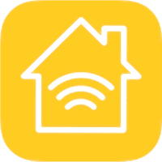

# ioBroker Homebridge accessories manager
=================

Use Homebridge plugins in ioBroker or run a global installed Homebridge as ioBroker adapter.
All States from Homebridge will be available in ioBroker too and can also be controlled there.

## Description
This adapter provides two different modes:

### Default (Wrapper) Mode
In the default mode the adapter allows you to use homebridge Plugin Modules directly.
You can explore all available plugins at the NPM website by [searching for the keyword `homebridge-plugin`](https://www.npmjs.com/search?q=homebridge-plugin).

You simply add the list of modules to the Adapter configuration and provide the configuration 
in the JSON-editor (see Plugin descriptions).
After this all Homebridge objects will be created in ioBroker too and all writable objects can
be changed too.

### Global-Homebridge-Mode
If you already use Homebridge (Apple OpenSource SmartHome) to control your devices
then you can use this existing Homebridge installation and start this Homebridge
installation as ioBroker process. In this case the Homebridge server is started by ioBroker.
Additionally all states from Homebridge are available as states in ioBroker and allows to
control from ioBroker.

For this to work you need to provide the location of the systems global node-modules folder. For this call **npm root -g**. Additionally you need to privide the path of the homebridge configuration directory (usually .homebridge in the users folder).

## Changelog

### 0.1.0 (2018.06.09)
* (Apollon77) Update for working mode 1

### 0.0.1 (2018.03.24)
* (kirovilya) initial commit

## License
The MIT License (MIT)

Copyright (c) 2018 Apollon77 <ingo@fischer-ka.de>

Permission is hereby granted, free of charge, to any person obtaining a copy
of this software and associated documentation files (the "Software"), to deal
in the Software without restriction, including without limitation the rights
to use, copy, modify, merge, publish, distribute, sublicense, and/or sell
copies of the Software, and to permit persons to whom the Software is
furnished to do so, subject to the following conditions:

The above copyright notice and this permission notice shall be included in
all copies or substantial portions of the Software.

THE SOFTWARE IS PROVIDED "AS IS", WITHOUT WARRANTY OF ANY KIND, EXPRESS OR
IMPLIED, INCLUDING BUT NOT LIMITED TO THE WARRANTIES OF MERCHANTABILITY,
FITNESS FOR A PARTICULAR PURPOSE AND NONINFRINGEMENT. IN NO EVENT SHALL THE
AUTHORS OR COPYRIGHT HOLDERS BE LIABLE FOR ANY CLAIM, DAMAGES OR OTHER
LIABILITY, WHETHER IN AN ACTION OF CONTRACT, TORT OR OTHERWISE, ARISING FROM,
OUT OF OR IN CONNECTION WITH THE SOFTWARE OR THE USE OR OTHER DEALINGS IN
THE SOFTWARE.
